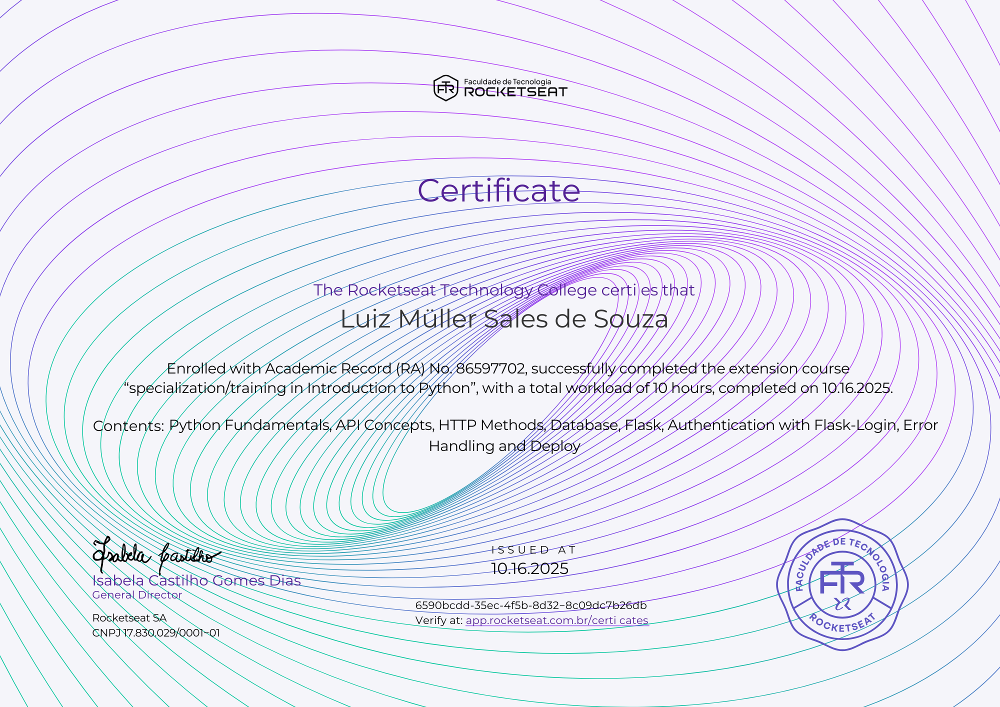

# 🛒 E-commerce API

This repository contains a fully functional e-commerce API, built from scratch with Python and the Flask framework. The project is designed to simulate a real-world online shopping system, demonstrating a comprehensive understanding of back-end web development principles, from initial setup to cloud deployment.

The core of the project is a **RESTful API** that exposes a series of endpoints to manage products, users, and shopping carts. Data persistence is handled by **Flask-SQLAlchemy**, using a SQLite database for simplicity in development and deployment.

### Key Features Implemented:
* **Complete Product Management:** CRUD (Create, Read, Update, Delete) operations for the product catalog, allowing administrators to manage inventory.
* **Authentication and Session System:** Routes for user registration, login, and logout, with protected endpoints that require authentication.
* **Dynamic Shopping Cart Management:** Functionalities to add, remove, and view items in an authenticated user's shopping cart.
* **Secure Checkout Process:** A route that simulates the completion of a purchase, clearing the user's cart upon conclusion.

The application is configured for production and has been deployed on the **AWS Elastic Beanstalk** platform, demonstrating the full software development lifecycle, from local conception to cloud availability.

---

## 📜 Certificate of Completion

To further validate the skills demonstrated in this project, here is the certificate obtained upon completion of the course/training related to this e-commerce API development:

<div align="center">

| Certificate |
|:---:|
|  |

</div>

---

## How to Run and Test Locally

Follow this guide to set up the environment and run the API on your machine.

### 1. Required facilities

Before starting, ensure you have these two tools installed:

### Python 3.12.12 or higher

- Download the official [Python](https://www.python.org/downloads/) installer.
- During installation, check the box **"Add Python to PATH"**.

### Postman v11 or higher

- Download the official [Postman](https://www.postman.com/downloads/) installer to send requests to the API.

---

### 2. Virtual environment configuration

Open your terminal in the project root folder and run these commands in order:

* **Create a virtual environment:**

```powershell
py -m venv venv
```

* **Fix PowerShell execution policy:**

```powershell
Set-ExecutionPolicy -ExecutionPolicy RemoteSigned -Scope Process
```

* **Activate the virtual environment:**

```powershell
.\venv\Scripts\activate
```

* **Install project dependencies:**

```powershell
pip install -r application/requirements.txt
```

Once activated, you will see `(venv)` at the start of your terminal line.

---

### 3. Running the API

With the environment ready, start the server using the following command:

```powershell
python application/application.py
```

The terminal will show:

```
* Running on http://127.0.0.1:5000
```

Keep this terminal open while testing.

---

### 4. Testing with Postman

Open Postman and use the local address:

```powershell
http://127.0.0.1:5000
```

### Initial test: list products

* **Paste the following URL for the listing route:** 

```powershell
http://127.0.0.1:5000/api/products
```

Using the **GET** method, submit a request to the local server.

**You should receive an empty list:**

```json
[]
```

### Creating a new user

To access protected routes, you need to create a user to log in.

* **Paste the following URL into the route to create a new user:** 

```powershell
http://127.0.0.1:5000/api/user/register
```
Using the **POST** method, send a **JSON** with your username and password to create the account on the local server.

```json
{
    "username": "yourusername",
    "password": "yourpassword"
}
```

> Once logged in, you will have access to all the routes provided by the API and can use them in any way you prefer.

---

## Existing routes for using the API

This is a detailed description of all the routes that were created for this application, along with an example body and its possible JSON returns.

### 1. Authentication

These routes manage user sessions. It is necessary to log in to obtain the session cookie used to authenticate protected routes.

#### `POST /api/user/register`
Register a user to start a session.

* **Body (Example):**
    ```json
    {
        "username": "user123",
        "password": "password123"
    }
    ```
* **Success Response (201):**
    ```json
    {
        "message": "User created successfully"
    }
    ```
* **Error Response (400):**
    ```json
    {
        "message": "User already exists"
    }
    ```

#### `POST /login`
Authenticates a user and starts a session.

* **Body (Example):**
    ```json
    {
        "username": "user123",
        "password": "password123"
    }
    ```
* **Success Response (200):**
    ```json
    {
        "message": "Logged is successfully"
    }
    ```
* **Error Response (401):**
    ```json
    {
        "message": "Unauthorized. Invalid credentials"
    }
    ```

#### `POST /logout`
Logs out the currently authenticated user. Requires a valid session cookie to be sent.

* **Success Response (200):**
    ```json
    {
        "message": "Logout successfully"
    }
    ```
* **Error Response (401):**
    ```json
    {
        "message": "Unauthorized. Invalid credentials"
    }
    ```

---

### 2. Products

Endpoints to manage and view the product catalog.

#### `GET /api/products`
Lists all available products in the catalog.

* **Success Response (200):**
    ```json
    [
        {
            "id": 1,
            "name": "Computer",
            "price": 3000.0
        },
        {
            "id": 2,
            "name": "Empty",
            "price": 0.0
        }
    ]
    ```
* **Error Response (404):**
    ```json
    {
        "message": "Not Found. No products available."
    }
    ```

#### `POST /api/products/add`
Adds a new product to the catalog. **(Authentication required)**

* **Body (Example):**
    ```json
    {
        "name": "Monitor",
        "price": 1500.0,
        "description": "Computer Accessory"
    }
    ```
* **Success Response (201):**
    ```json
    {
        "message": "Product added successfully"
    }
    ```
* **Error Response (400):**
    ```json
    {
        "message": "Failed to add the product"
    }
    ```

#### `PUT /api/products/update/{product_id}`
Updates the information of an existing product. **(Authentication required)**

* **URL Parameter:** `product_id` (e.g., `/api/products/update/1`)
* **Body (Example):**
    ```json
    {
        "name": "Quantum Computer",
        "price": 6000.0,
        "description": "More powerful computer"
    }
    ```
* **Success Response (200):**
    ```json
    {
        "message": "Product update successfully"
    }
    ```
* **Error Response (404):**
    ```json
    {
        "message": "Product not found"
    }
    ```

#### `DELETE /api/products/delete/{product_id}`
Deletes a product from the catalog. **(Authentication required)**

* **URL Parameter:** `product_id` (e.g., `/api/products/delete/1`)
* **Success Response (200):**
    ```json
    {
        "messagem": "Product deleted successfully"
    }
    ```
* **Error Response (404):**
    ```json
    {
        "message": "Product not found"
    }
    ```

---

### 3. Shopping Cart

Endpoints to manage the authenticated user's shopping cart.

#### `GET /api/cart`
Views all items in the user's cart. **(Authentication required)**

* **Success Response (200):**
    ```json
    [
        {
            "id": 1,
            "user_id": 1,
            "product_id": 1,
            "product_name": "Quantum Computer",
            "product_price": 6000.0
        }
    ]
    ```
* **Error Response (401):**
    ```json
    {
        "message": "Unauthorized. User not logged in"
    }
    ```

#### `POST /api/cart/add/{product_id}`
Adds an item to the cart. **(Authentication required)**

* **URL Parameter:** `product_id` (e.g., `/api/cart/add/1`)
* **Success Response (200):**
    ```json
    {
        "message": "Item added to the cart successfully"
    }
    ```
* **Error Response (400):**
    ```json
    {
        "message": "Failed to add item to the cart"
    }
    ```

#### `DELETE /api/cart/remove/{product_id}`
Removes an item from the cart. **(Authentication required)**

* **URL Parameter:** `product_id` (e.g., `/api/cart/remove/1`)
* **Success Response (200):**
    ```json
    {
        "message": "Item removed from the cart successfully"
    }
    ```
* **Error Response (400):**
    ```json
    {
        "message": "Failed to remove item from the cart"
    }
    ```

#### `POST /api/cart/checkout`
Finalizes the purchase and clears all items from the cart. **(Authentication required)**

* **Success Response (200):**
    ```json
    {
        "message": "Checkout successful. Cart has been cleared."
    }
    ```
* **Error Response (401):**
    ```json
    {
        "message": "Unauthorized. User not logged in"
    }
    ```
---

## 💡 Usage and Contact

Feel free to use this API as a reference or a foundation for your own projects. Make good use of it in your programs and take full advantage of the available features to learn and create.

---

### 👨‍💻 Author

Thanks for checking out this project! Great programming logic to all!

* **GitHub:** [LuizMullerSouza](https://github.com/LuizMullerSouza)
* **Instagram:** [@luizmullerz](https://www.instagram.com/luizmullerz/)

Happy coding!